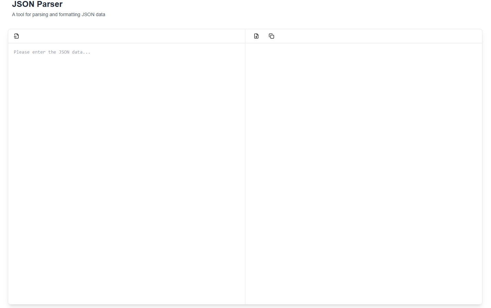
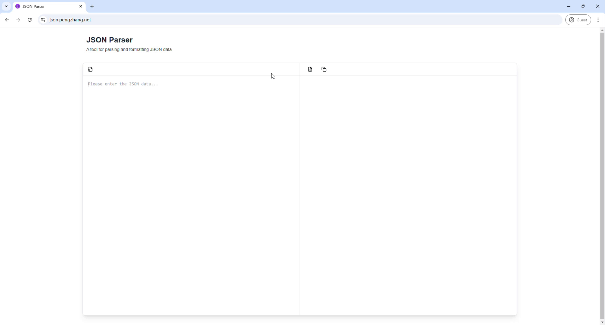

# JSON Parser

<p align="center">
  
</p>

A modern, user-friendly JSON parser and formatter built with Next.js and TypeScript. Try it out at [demo link].

[](https://github.com/luckzp/json-parser)
[](https://opensource.org/licenses/MIT)

## ✨ Features

- 🚀 Real-time JSON parsing and validation
- 🎨 Beautiful syntax highlighting
- 📦 Collapsible JSON tree view
- 🔄 Auto-format JSON data
- 💾 Download parsed JSON as file
- 📋 Copy formatted JSON to clipboard
- 🛠 Automatic escape character handling
- 🎯 User-friendly error messages

## 🖥 Demo

<p align="center">
  
</p>

## 🚀 Getting Started

1. Clone the repository:

```bash
git clone https://github.com/luckzp/json-parser.git
```

2. Install dependencies:

```bash
cd json-parser
npm install
```

3. Run the development server:

```bash
npm run dev
```

4. Open [http://localhost:3000](http://localhost:3000) with your browser to see the result.

## 🛠 Usage

1. Enter or paste your JSON data into the left panel
2. The parser will automatically validate and format your input
3. Use the collapse/expand buttons to navigate through nested structures
4. Download or copy the formatted JSON using the toolbar buttons

## 🎨 Technologies

- [Next.js 14](https://nextjs.org/)
- [TypeScript](https://www.typescriptlang.org/)
- [Tailwind CSS](https://tailwindcss.com/)
- [shadcn/ui](https://ui.shadcn.com/)
- [Lucide Icons](https://lucide.dev/)

## 🤝 Contributing

Contributions, issues and feature requests are welcome! Feel free to check the [issues page](https://github.com/luckzp/json-parser/issues).

## ⭐️ Show your support

Give a ⭐️ if this project helped you! Your support motivates me to maintain and improve this tool.

## 📝 License

This project is [MIT](LICENSE) licensed.

---

Made with ❤️ by [Your Name](https://github.com/luckzp)
